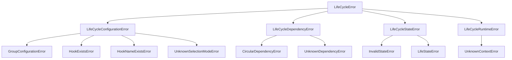

# lifecycle – управление жизненным циклом приложения

[](https://python.org)
[](LICENSE)
[](https://github.com/astral-sh/ruff)
[](https://mypy-lang.org/)
[](https://lifecycle.readthedocs.io/)

**lifecycle** — это библиотека для управления жизненным циклом компонентов приложения через механизм исполняемых хуков (hooks). Она позволяет гибко настраивать инициализацию, завершение, сброс и обработку ошибок с учётом зависимостей между компонентами.

## Особенности

- ✅ **Гибкие хуки** – создавайте хуки через наследование или адаптеры.
- 🔗 **Зависимости** – управляйте порядком выполнения для каждого контекста (`INIT`, `QUIT`, `RESET`, `ERROR`).
- 📦 **Группы хуков** – стратегии `ALL` (выполнить все) или `ONE` (первый успешный).
- ⚠️ **Обработка ошибок** – поддержка обязательных (`REQUIRED`) и опциональных (`OPTIONAL`) хуков с фатальными и некритичными ошибками.
- 🔄 **Сброс состояния** – полная переинициализация через `reset()`.
- 📝 **Русскоязычное логирование** – все сообщения на русском языке для удобства отладки.
- 🧪 **Строгая типизация** – аннотации типов (PEP 484), проверка mypy.

---

## Оглавление

- [Требования](#требования)
- [Установка](#установка)
- [Быстрый старт](#быстрый-старт)
  - [Создание хука через класс](#создание-хука-через-класс)
  - [Создание хука через адаптер](#создание-хука-через-адаптер)
  - [Зависимости между хуками](#зависимости-между-хуками)
  - [Группы хуков](#группы-хуков)
  - [Обработка ошибок](#обработка-ошибок)
  - [Сброс жизненного цикла](#сброс-жизненного-цикла)
- [Документация API](#документация-api)
- [Логирование](#логирование)
- [Исключения](#исключения)
- [Структура проекта](#структура-проекта)
- [Разработка](#разработка)
- [Лицензия](#лицензия)

---

## Требования

- Python 3.10 или выше
- Зависимости: `typeguard>=4.4.0`

---

## Установка

### Из PyPI (рекомендовано)

```bash
pip install lifecycle
```

### Из исходного кода

```bash
git clone https://github.com/Romana8192/lifecycle.git
cd lifecycle
pip install .
```

### Для разработки

```bash
git clone https://github.com/Romana8192/lifecycle.git
cd lifecycle
uv sync
```

---

## Быстрый старт

### Создание хука через класс

Унаследуйте `BaseExecutableHook` и переопределите методы `_do_init`, `_do_quit` и т.д.

```python
from lifecycle import LifeCycle, BaseExecutableHook, HookResult


class DatabaseHook(BaseExecutableHook):
    def _do_init(self) -> HookResult:
        print("Подключение к БД...")
        return HookResult.SUCCESS

    def _do_quit(self) -> HookResult:
        print("Отключение от БД...")
        return HookResult.SUCCESS


lc = LifeCycle(hooks=[DatabaseHook("db")])
lc.initialize()  # Подключение к БД...
lc.finalize()  # Отключение от БД...
```

### Создание хука через адаптер

Используйте `create_adapter` и `HookCallbacks`:

```python
from lifecycle import LifeCycle, create_adapter, HookCallbacks, HookResult


def on_init() -> HookResult:
    print("Адаптер: инициализация")
    return HookResult.SUCCESS


hook = create_adapter("my_hook", HookCallbacks(init=on_init))
lc = LifeCycle(hooks=[hook])
lc.initialize()  # Адаптер: инициализация
```

### Зависимости между хуками

Задайте порядок выполнения через атрибут `dependencies`:

```python
from lifecycle import BaseExecutableHook, HookDependency, DependenceOrder


class DatabaseHook(BaseExecutableHook):
    def _do_init(self):
        print("DB init")

    def _do_quit(self):
        print("DB quit")


class CacheHook(BaseExecutableHook):
    dependencies = (
        HookDependency(
            "database",
            init_order=DependenceOrder.AFTER,  # инициализация после DB
            quit_order=DependenceOrder.BEFORE,  # завершение до DB
        ),
    )

    def _do_init(self):
        print("Cache init (after DB)")

    def _do_quit(self):
        print("Cache quit (before DB)")
```

### Группы хуков

Группы позволяют выбрать стратегию выполнения: `ALL` (все) или `ONE` (первый успешный).

```python
from lifecycle import create_group, SelectionMode, LifeCycle

group = create_group(SelectionMode.ONE, "fallback", hooks=[...])
lc = LifeCycle(group=group)
```

### Обработка ошибок

- `HookResult.SUCCESS` – успех.
- `HookResult.FAILURE` – некритичная ошибка (логируется, выполнение продолжается).
- `HookResult.FATAL` – фатальная ошибка (останавливает группу, запускает откат).

```python
class RequiredFailingHook(BaseExecutableHook):
    requirement = HookRequirement.REQUIRED

    def _do_init(self):
        raise RuntimeError("Критическая ошибка")


lc = LifeCycle(hooks=[RequiredFailingHook("fatal")])
success = lc.initialize()  # False, состояние ERROR
```

### Сброс жизненного цикла

Метод `reset()` переинициализирует все компоненты, вызывая `_do_reset` у хуков.

```python
lc = LifeCycle(hooks=[...])
lc.initialize()
# ... работа ...
lc.reset()  # полный перезапуск
```

---

## Документация API

Полная документация доступна онлайн: [https://lifecycle.readthedocs.io](https://lifecycle.readthedocs.io)

Или через встроенную справку Python:

```python
help(lifecycle.LifeCycle)
help(lifecycle.BaseExecutableHook)
help(lifecycle.create_adapter)
```

Основные публичные элементы:

| Категория          | Классы / функции                                                              |
|--------------------|-------------------------------------------------------------------------------|
| **Ядро**           | `LifeCycle`                                                                   |
| **Хуки**           | `BaseExecutableHook`, `ExecutableHook`, `create_adapter`                      |
| **Группы**         | `AllGroup`, `OneGroup`, `BaseGroup`, `create_group`                           |
| **Типы**           | `HookContext`, `HookResult`, `LifeState`, `SelectionMode`, `DependenceOrder`,<br> `HookDependency`, `HookRequirement`, `HookCallbacks` |
| **Исключения**     | все исключения от `LifeCycleError`                                            |

---

## Логирование

Библиотека использует модуль `logging` с логгерами (`lifecycle.core`, `lifecycle.groups`, ...). Все сообщения — на русском языке. Настройте вывод:

```python
import logging

logging.basicConfig(
    level=logging.INFO, format="%(asctime)s - %(name)s - %(levelname)s - %(message)s"
)
```

Пример вывода:
```
2025-03-30 12:00:00,000 - lifecycle.core - INFO - Запуск инициализации LifeCycle (текущее состояние NEW)
2025-03-30 12:00:00,001 - lifecycle.groups - INFO - Группа 'root' обрабатывает контекст INIT (состояние NEW)
```

---

## Исключения

Все исключения наследуются от `LifeCycleError`. Иерархия:



| Исключение                      | Описание                                    | Пример сообщения (рус.)                                      |
|---------------------------------|---------------------------------------------|--------------------------------------------------------------|
| `LifeCycleConfigurationError`   | Ошибка конфигурации                         | `"Нельзя указать оба параметра 'group' и 'hooks'"`           |
| `CircularDependencyError`       | Циклическая зависимость                     | `"Циклическая зависимость в группе 'root'"`                  |
| `UnknownDependencyError`        | Зависимость на несуществующий хук           | `"Хук 'cache' зависит от неизвестного хука 'unknown'"`       |
| `InvalidStateError`             | Операция в неподходящем состоянии           | `"Недопустимое состояние для инициализации: LifeState.ERROR"`|

Все исключения содержат русскоязычные сообщения.

---

## Структура проекта

> Ссылки ведут на исходный код в репозитории GitHub.

- [`lifecycle/__init__.py`](https://github.com/Romana8192/lifecycle/blob/main/src/lifecycle/__init__.py) – публичный интерфейс
- [`lifecycle/core.py`](https://github.com/Romana8192/lifecycle/blob/main/src/lifecycle/core.py) – `LifeCycle`
- [`lifecycle/hooks.py`](https://github.com/Romana8192/lifecycle/blob/main/src/lifecycle/hooks.py) – `BaseExecutableHook`, `create_adapter`
- [`lifecycle/groups.py`](https://github.com/Romana8192/lifecycle/blob/main/src/lifecycle/groups.py) – группы хуков
- [`lifecycle/lifecycle_types.py`](https://github.com/Romana8192/lifecycle/blob/main/src/lifecycle/lifecycle_types.py) – перечисления и типы
- [`lifecycle/exceptions.py`](https://github.com/Romana8192/lifecycle/blob/main/src/lifecycle/exceptions.py) – иерархия исключений

---

## Разработка

Для запуска тестов, линтинга и форматирования используйте `make`:

```bash
make test          # запуск тестов с покрытием
make lint          # ruff check
make format        # ruff format
make clean         # удаление временных файлов
```

Ручной запуск:

```bash
pytest tests/
ruff check .
mypy src/lifecycle
```

Подробнее в [CONTRIBUTING.md](CONTRIBUTING.md).

---

## Лицензия

Распространяется под лицензией MIT. Подробности в файле [LICENSE](LICENSE).

---

## Авторы

- Romana8192 – [dashof72@gmail.com](mailto:dashof72@gmail.com)

Вопросы и предложения принимаются через [Issues](https://github.com/Romana8192/lifecycle/issues) или по электронной почте.